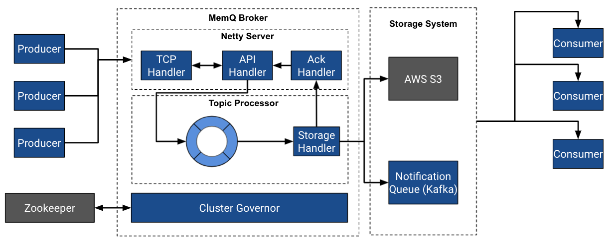

# MemQ: An efficient, scalable cloud native PubSub system

MemQ is a new PubSub system that augments Kafka at Pinterest. It uses a decoupled storage and serving architecture similar to Apache Pulsar and Facebook Logdevice; however, it relies on a pluggable replicated storage layer i.e. Object Store / DFS / NFS for storing data. The net result is a PubSub system that:

- Handles GB/s traffic
- Independently scales, writes, and reads
- Doesn’t require expensive rebalancing to handle traffic growth
- Is 90% more cost effective than our Kafka footprint

## Getting Started

Checkout our [Getting Started](docs/gettingstarted.md) Guide

## Usage

MemQ can be a valuable PubSub choice for the following use case families:

- Large scale data ingestion
- Bulk uploads
- Near Real Time Analytics

## Design

Detailed architecture docs can be found [here](docs/architecture.md)

## Blog

Please checkout the [original MemQ blog](https://medium.com/pinterest-engineering/memq-an-efficient-scalable-cloud-native-pubsub-system-4402695dd4e7) for details and background.

## Authors

[Ambud Sharma](https://github.com/ambud)

[Ping Min-Lin](https://github.com/kabochya)

See [contributors](CONTRIBUTORS.md)

## License

MemQ distributed under [Apache License, Version 2.0](LICENSE)
