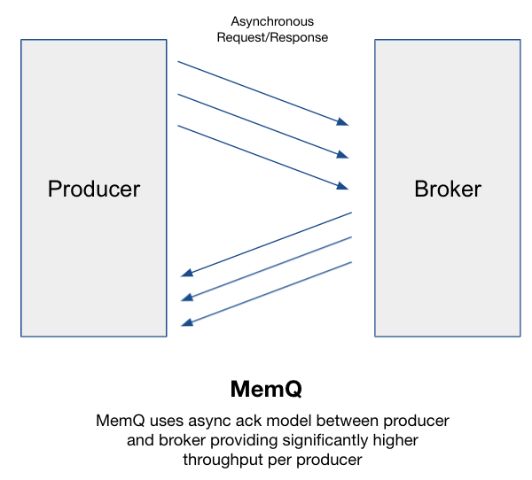

# Architecture

Below are the components of MemQ and the roles they play.

## Components
### Client
MemQ client discovers the cluster using a seed node and then connects to the seed node to discover metadata and the Brokers hosting the TopicProcessors for a given Topic or, in case of the consumer, the address of the notification queue.

### Broker
Similar to other PubSub systems, MemQ has the concept of a Broker. A MemQ Broker is a part of the cluster and is primarily responsible for handling metadata and write requests.
Note: read requests in MemQ can be handled directly by the Storage layer unless the read Brokers are used

### Cluster Governor
The Governor is a leader in the MemQ cluster and is responsible for automated rebalancing and TopicProcessor assignments. Any Broker in the cluster can be elected a Governor, and it communicates with Brokers using Zookeeper, which is also used for Governor election.
The Governor makes assignment decisions using a pluggable assignment algorithm. The default one evaluates available capacity on a Broker to make allocation decisions. Governor also uses this capability to handle Broker failures and restore capacity for topics.

### Topic & TopicProcessor
MemQ, similar to other PubSub systems, uses the logical concept of Topic. MemQ topics on a Broker are handled by a module called TopicProcessor. A Broker can host one or more TopicProcessors, where each TopicProcessor instance handles one topic. Topics have write and read partitions. The write partitions are used to create TopicProcessors (1:1 relation), and the read partitions are used to determine the level of parallelism needed by the consumer to process the data. The read partition count is equal to the number of partitions of the notification queue.

### Storage
MemQ storage is made of two parts:
Replicated Storage (Object Store / DFS)
Notification Queue (Kafka, Pulsar, etc.)

**Replicated Storage**

MemQ allows for pluggable storage handlers. At present, we have implemented a storage handler for Amazon S3. Amazon S3 offers a cost effective solution for fault-tolerant, on-demand storage. The following prefix format on S3 is used by MemQ to create the high throughput and scalable storage layer:
s3://<bucketname>/<(a) 2 byte hash of first client request id in batch>/<(b) cluster>/topics/<topicname>
(a) = used for partitioning inside S3 to handle higher request rates if needed
(b) = name of MemQ cluster

*Availability & Fault Tolerance*

Since S3 is a highly available web scale object store, MemQ relies on its availability as the first line of defense. To accommodate for future S3 re-partitioning, MemQ adds a two-digit hex hash at the first level of prefix, creating 256 base prefixes that can, in theory, be handled by independent S3 partitions just to make it future proof.

*Consistency*

The consistency of the underlying storage layer determines the consistency characteristics of MemQ. In case of S3, every write (PUT) to S3 Standard is guaranteed to be replicated to at least three Availability Zones (AZs) before being acknowledged.

**Notification Queue**

The notification system is used by MemQ for delivering pointers to the consumer for the location of data. Currently, we use an external notification queue in the form of Kafka. Once data is written to the storage layer, the Storage handler generates a notification message recording the attributes of the write including its location, size, topic, etc. This information is used by the consumer to retrieve data (Batch) from the Storage layer. It’s also possible to enable MemQ Brokers to proxy Batches for consumers at the expense of efficiency. The notification queue also provides clustering / load balancing for the consumers.

## Producing Data

A MemQ producer is responsible for sending data to Brokers. It uses an async dispatch model allowing for non-blocking sends to happen without the need to wait on acknowledgements.
This model was critical in order to hide the upload latencies for the underlying storage layers while maintaining storage level acknowledgements. This leads to the implementation of a custom MemQ protocol and client, as we couldn’t use existing PubSub protocols, which relied on synchronous acknowledgements. MemQ supports three types of acks: ack=0 (producer fire & forget), ack=1 (Broker received), and ack=all (storage received). With ack=all, the replication factor (RF) is determined by the underlying storage layer (e.g. in S3 Standard RF=3 [across three AZs]). In case acknowledgement fails, the MemQ producers can explicitly or implicitly trigger retries.

## Storing Data
The MemQ Topic Processor is conceptually a RingBuffer. This virtual ring is subdivided into Batches, which allows simplified writes. Messages are enqueued into the currently available Batch as they arrive over the network until either the Batch is filled or a time-based trigger happens. Once a Batch is finalized, it is handed to the StorageHandler for upload to the Storage layer (like S3). If the upload is successful, a notification is sent via the Notification Queue along with the acknowledgements (ack) for the individual Messages in the Batch to their respective Producers using the AckHandler if the producers requested acks.

## Consuming Data
MemQ consumer allows applications to read data from MemQ. The consumer uses the Broker metadata APIs to discover pointers to the Notification Queue. We expose a poll-based interface to the application where each poll request returns an Iterator of LogMessages to allow reading all LogMessages in a Batch. These Batches are discovered using the Notification Queue and retrieved directly from the Storage layer.

## Other Features
**Data Loss Detection:** Migrating workloads from Kafka to MemQ required strict validation on data loss. As a result, MemQ has a built in auditing system that enables efficiently tracking E2E delivery of each Message and publishing metrics in near real-time.

**Batch & Streaming Unification:** Since MemQ uses an externalized storage system, it enables the opportunity to provide support for running direct batch processing on raw MemQ data without needing to transform it to other formats. This allows users to perform ad hoc inspection on MemQ without major concerns around seek performance as long as the storage layer can separately scale reads and writes. Depending on the storage engine, MemQ consumers can perform concurrent fetches to enable much faster backfills for certain streaming cases.

## Secret Sauce

The secret of MemQ is that it leverages micro-batching and immutable writes to create an architecture where the number of Input/output Operations Per Second (IOPS) necessary on the storage layer are dramatically reduced, allowing the cost effective use of a cloud native Object Store like Amazon S3. This approach is analogous to packet switching for networks (vs circuit switching, i.e. single large continuous storage of data such as kafka partition).

MemQ breaks the continuous stream of logs into blocks (objects), similar to ledgers in Pulsar but different in that they are written as objects and are immutable. The size of these “packets” / “objects,” known internally in MemQ as a Batch, play a role in determining the End-to-End (E2E) latency. The smaller the packets, the faster they can be written at the cost of more IOPS. MemQ therefore allows tunable E2E latency at the cost of higher IOPs. A key performance benefit of this architecture is enabling separation of read and write hardware dependending on the underlying storage layer, allowing writes and reads to scale independently as packets that can be spread across the storage layer.

This also eliminated the constraints experienced in Kafka where in order to recover a replica, a partition must be re-replicated from the beginning. In the case of MemQ, the underlying replicated storage only needs to recover the specific Batch whose replica counts were reduced due to faults in case of storage failures. However, since MemQ at Pinterest runs on Amazon S3, the recovery, sharding, and scaling of storage is handled by AWS without any manual intervention from Pinterest.